### Databases
- ValKey v8.0.2
- kvrocks nightly-20250119-571b022

### Prerequisites

- A recent version of Nodejs with typescript support. (see [TypeScript | Node.js Documentation](https://nodejs.org/api/typescript.html#:~:text=%23-,History))
- Docker installed and the `docker` command available in the terminal.

### Setup

1. Clone the repository:
```sh
git clone https://github.com/lilnasy/redis-alternatives-benchmark
cd redis-alternatives-benchmark
```

2. Install the dependencies:
```sh
npm install
```

### Running the Benchmark

The benchmark script starts ValKey and Kvrocks in docker containers, benchmarks them using a third container, processes the results, and updates this README with the results. 
```sh
node --run benchmark
```
The first time you run the benchmark, it will take longer as docker downloads the container images.

# Results

```mermaid
---
config:
    themeVariables:
        xyChart:
            plotColorPalette: "#5cb3ff80, #f88f4f80"
---
xychart-beta horizontal
title "ValKey (memory-only) vs Kvrocks (memory + NVMe)"
x-axis ["PING_INLINE", "PING_MBULK", "SET", "GET", "INCR", "LPUSH", "RPUSH", "LPOP", "RPOP", "SADD", "HSET", "SPOP", "ZADD", "ZPOPMIN", "LPUSH (needed to benchmark LRANGE)", "LRANGE_100 (first 100 elements)", "LRANGE_300 (first 300 elements)", "LRANGE_500 (first 500 elements)", "LRANGE_600 (first 600 elements)", "MSET (10 keys)", "XADD"]
y-axis "1,000 requests per second (higher is better)"
bar [247.52475, 221.23894, 224.21523000000002, 254.45292, 261.78011, 249.37655999999998, 224.21523000000002, 229.88506, 163.39870000000002, 187.61727, 249.37655999999998, 235.29411, 253.16455, 265.252, 216.91973000000002, 58.07201, 21.77226, 14.12429, 11.33658, 135.68522000000002, 185.52876999999998]
bar [207.46888, 158.73016, 81.30081, 176.05632999999997, 64.51613, 56.52911, 52.16484, 59.88024, 63.65372, 59.988, 60.53269, 165.28925, 46.620050000000006, 154.79875, 57.24098, 23.89486, 8.838610000000001, 5.793069999999999, 4.878760000000001, 39.16961, 54.58515]
```

<!-- chart-begin -->

<!-- chart-end -->

ValKey (blue) unsuprisingly has a higher throughput than Kvrocks (orange). Nevertheless, Kvrocks still performs close enough that it is a viable option for the same use-cases as ValKey. The fact that Kvrocks can support larger-than-memory datasets by offloading to persistent NVMe storage is a huge advantage.

However, Kvrocks is concerningly liberal with its memory allocation, starting with a memory usage of **50MB** and finishing the benchmark at over **300MB**. This is true even after making sure it is not storing any data with `FLUSHALL`. Meanwhile, Valkey peaks at around **80MB** and oscillates back to about **15MB**. It is possible this is only an artifact of the synthetic benchmark. When hosting larger datasets, Kvrocks' memory usage might still be mostly used for the dataset itself instead of for operational overhead. Determining that would probably require extensive real world usage.
